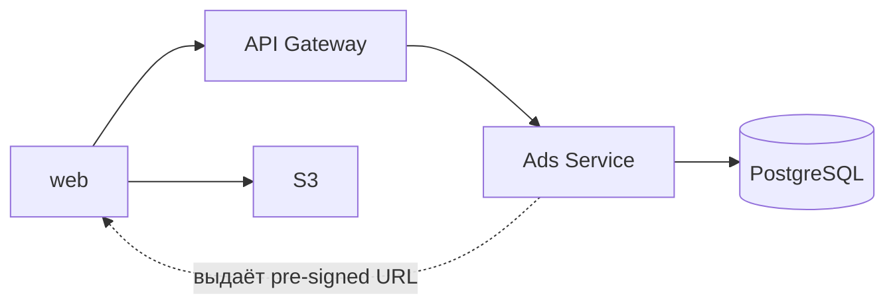
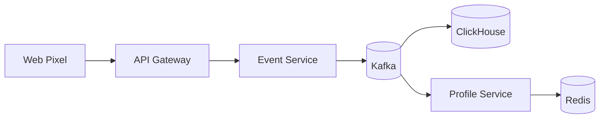
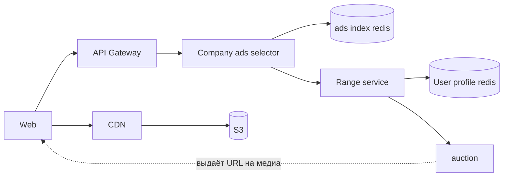

# ДЗ 1. Анализ референсной архитектуры — решение

> Условие: [../Задание.md](../Задание.md) · Чек-лист: [../Чеклист.md](../Чеклист.md)
> Схемы складывайте в [diagrams/](diagrams/).

## Выбранная архитектура

_Рекламная система._

## 0. Контекст

1. Система объединяет рекламодателей и площадки с контентом, желающие иметь монетизацию за счет размещения рекламы среди имеющегося на площадке контента. Коллектит действия пользователя.  Размещает рекламные компании рекламодателей. При запросе на показ рекламы, выбирает объявление и передает площаюке для показа пользователю.
2. Акторы:
   - Рекламодатель: размещает рекламную компанию в рекламной системе, задает бюджет и таргетинг. 
   - Площадки: сайты, приложения, запрашивают рекламу по api и отображают у себя среди контента, трекают действия пользователей в рекламную систему для определения таргетинга.
3. Ключевые сценарии:
   - Реламодатель размещает рекламную компанию в системе. Указывает бюджет, таргетинг, сроки.
   - Площадка при помощи встройки пикселя от рекламной системы трекает действия пользователя на сайте. Рекламная система собирает все действия пользователя и формирует профиль, по которому определяет таргетинг.
   - Площадка запрашивает рекламу у рекламной системы. Рекламная система из рекламодателей отбирает кандидатов, вычисляет наиболее подходящих и среди них проводит аукцион. У рекламодателя "победившего" в аукционе собирают информацию необходимую для показа и отправляет площадке, которая отобращает рекламу. Площадка трекает просмотр рекламы пользователем. 
4. Маштаб:
   - До 1млн rps на запрос на показ. sla 100-120 мс на вычисление и показ рекламного объявления.
   - До 100тыс rps на трекинг поведения пользователей (за счет отправки событий батчами с ui)

## 1. Компоненты

1. Api gateway. Авторизация и аутентификация, маршрутизация запросов. Не хранит состояние.
2. Сервис сбора данных. Проверка валидности данных, фильтрация. Батчинг. Не хранит состояние.
3. Брокер сообщений. Для асинхронного взаимодействия с базой для хранения данных по пользователю.
4. Бд для сбора аналитики поведения пользователей.
5. Бд для хранения профиля пользователя.
6. Сервис для формирования профиля пользователя. Читает данные из кафки и сохраняет в хранилище с быстрым доступом профиль пользователя. Не хранит состояние
7. Бд для хранения рекламных компаний.
8. Кеш для рекламных компаний. (Redis)
9. Сервис для отбора кандидатов из рекламных компаний. Не хранит состояние 
10. Сервис ранжирования рекламных компаний. Выбираем подходящие по профилю пользователя рекламный компании. Не хранит состояние.
11. Сервис аукциона. Среди подходящих рекламных компаний, выбираем самую выгодную для рекламной системы. Не хранит состояние.
12. S3 хранилище медиа файлов рекламных компаний. 
13. CDN для быстрого геораспределенного кеширования медиа файлов
14. Сервис отвечающий за создание рекламной компании. Не хранит состояние.

## 2. Потоки данных

### Размещение рекламной компании в системе

1. Клиентское приложение(web) отправляет данные рекламной компании в ads service через api gateway. 
2. ads service проверяет права и возвращает pre-signed url для загрузки медиа в s3. 
3. Клиент загружает медиа в s3.
4. Клиент сообщет сервису об успешной загрузке.
5. ads service сохраняет данные по рекламной компании + s3 key в postgreSQL

Все взаимодействия синхронные
В случае сбоя возвращает понятную ошибку пользователю. Клиент дает возможность повторить действие.

### Площадка трекает действия пользователя на сайте

1. Клиент через встроенный пиксель собирает действия пользователя, клики, просмотры и тд и собирает это все в батчи
2. Пиксель отправляет батч через гейтвей в эвент сервис.
3. Эвент сервис валидирует батч, проверяет на перс данные, при необходимости фильтрует
4. Асинхронно через брокер отправляет бд и сервис профиля
5. Profile service формирует профиль пользователя и сохраняет в быстрое хранилище (Redis?) При необходимости можно из бд восстановить профиль пользователя

В случае сбоя есть возможность отправить батч повторно с фронта

### Площадка запрашивает рекламу у рекламной системы

1. Площадка отправляет запрос на показ рекламы через API Gateway в Company Ads Selector (не хранит состояние).
2. Company Ads Selector получает из Ads Index Redis список активных рекламных кампаний.
3. Range Service проверяет соответствие кампаний профилю пользователя из User Profile Redis.
4. Подходящие рекламные кампании передаются в Auction Service(не хранит состояние).
5. Auction Service проводит аукцион и выбирает победившую кампанию.
6. Company Ads Selector возвращает площадке данные для показа: URL медиа в CDN, ссылку перехода и идентификатор показа.
7. Площадка загружает медиа через CDN. При отсутствии файла в кэше CDN получает его из S3.
8. Площадка отправляет событие о просмотре рекламы в рекламную систему.

## 3. Проблемы и решения

### Kafka
Kafka отделяет сбор пользовательских событий от их обработки и хранения в ClickHouse. Event Service быстро принимает события и передаёт их в Kafka, не ожидая завершения записи в БД.
Что сломалось бы без Kafka:
- при недоступности Clickhouse события могут потеряться
- ClickHouse может не справиться с нагрузкой
- Event Service Зависит от скорости записи в бд
- при появлении новых потребителей нужно менять event service

Trade-offs:
- Выигрываем устойчивостью к нагрузкам, возможностью масштабировать независимо от продюсеров/консьюмеров, возможностью повторить обработку
- Жертвуем: задержки в обработке, увеличивается сложность системы

### Ads Index Redis
Хранит индекс активных рекламных кампаний и позволяет быстро подобрать кандидатов для показа. Рекламный запрос не обращается к PostgreSQL.

Что сломалось бы без него:
- увеличиться задержка ответа
- база станет узким место 
- подбор рекламы не будет укладываться в sla

Trade-offs
- выигрываем низкую задержку поиска рекламы, высокую пропускную способность, снижение нагрузки на бд
- жертвуем: сложность системы, устаревание данных, необходимость синхронизации кеша и бд

### CDN
CDN кэширует рекламные медиа рядом с пользователями и быстро отдаёт их площадке. S3 используется как origin-хранилище.

Что сломалось бы без него:
- возрастет задержка загрузки
- пользователи из удаленных регионов будут дольше получать рекламу

Trade-offs
- выигрываем низкую задержку выдачи медиа, снижение нагрузки на s3, геомасштабирование
- жертвуем: возможность устаревание кэша, доп стоимость и сложность инфры

## 4. Вопросы к авторам архитектуры

